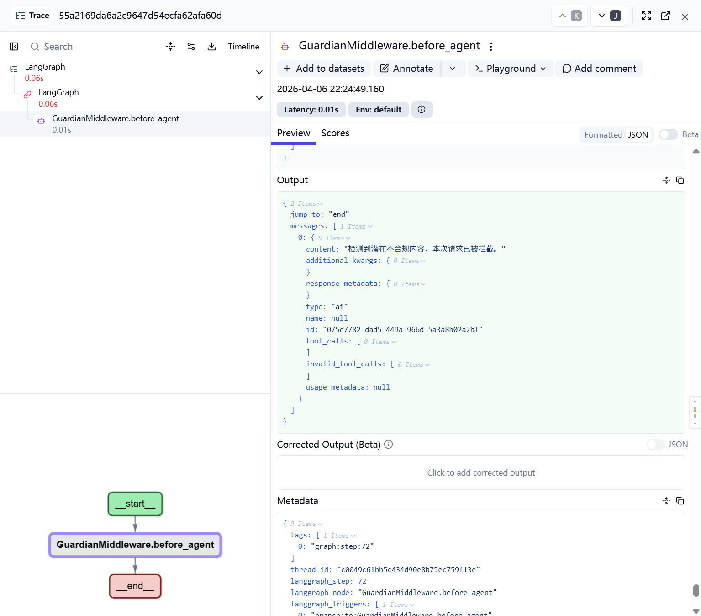

# Mini-OpenClaw

**本地运行、文件优先、可审计** 的 AI Agent 工作台，一定程度上解决Openclaw的长期记忆及安全问题：
1. 对话与证据落盘为本地 JSON；
2. 长期记忆由 `memory_module_v2` 做结构化蒸馏与混合检索实现11倍tokens压缩；
3. 接入自己微调的Qwen3.5 4b模型配合Langchain的before_agent middleware用于合规内容检测；
4. 基于 SKILL构建能力编排层，按需调度多个Tools；
5. System Prompt自动拼接
6. 接入Langfuse，Prompt、工具轨迹、记忆检索与注入过程都排查；


## 效果展示

### 页面：


### Prompt攻击防御：



### 蒸馏后的部分记忆片段：


## 适合谁
拿来学习和扩展Agent功能的你
## TODO LIST
- 学习Claude Code，尝试融合会话压缩、subagent分配、System Prompt优化等机制
- 加入定时任务、心跳检测等功能

## 为什么是它

- **可审计**：会话在 `sessions/*.json`，记忆对象与证据可追溯到具体轮次；索引（向量 / BM25）可丢弃重建；搭配Langfuse实现Query全链路追踪
- **分层记忆**：v2 将「结构化检索对象」与「原始 verbatim 证据」分开，命中后可回跳，而不是只剩一段模型摘要。
- **工程化 Agent 栈**：基于 **LangChain 1.x `create_agent`**，可选 **Guardian 前置审查**、**对话摘要中间件**、**Postgres Checkpointer**；与 **Langfuse** 等追踪可选对接。
- **技能即文档**：技能目录 + `SKILL.md`，配合快照按需加载，扩展和 Code Review 都轻量。

## 它现在能做什么

- **流式对话**：FastAPI + SSE，推送 token、工具调用与分段回复。
- **会话持久化**：每轮写入 `api_server/sessions/*.json`。
- **长期记忆**：`api_server/memory_module_v2/` — 结构化蒸馏、证据回跳、`dense + BM25 + RRF` 混合检索；可选 **独立蒸馏模型**（`DISTILL_*`）以节省主模型 token。
- **技能系统**：先读技能快照，再按需拉取 `SKILL.md`。
- **三栏工作台**：会话列表、聊天区、右侧文件检查器；可在线编辑 Memory / Skills / Workspace。
- **记忆注入策略**：`tool`（Agent 自主 `search_memory`）/ `always` / `off`（见下文环境变量）。
- **安全与运维**
  - **Guardian**：在 Agent 执行前用轻量模型判定用户消息是否疑似提示词注入 / 越权；可单独配置 `GUARDIAN_PROVIDER`、超时与 **fail-open / fail-closed**（`GUARDIAN_FAIL_MODE`）。
  - **短期对话压缩**：可选 `SummarizationMiddleware`，按消息条数触发摘要、保留最近若干条（`SUMMARIZATION_*`）。
  - **状态持久化**：可选 Postgres LangGraph **checkpointer**，便于多轮会话状态恢复（`CHECKPOINTER` / `POSTGRES_*`）。
  - **可观测性**：可选 **Langfuse** 密钥与地址，接入追踪。

## 技术栈

### 后端

- Python 3.10+
- FastAPI
- LangChain 1.x（`create_agent` + 可选中间件）
- OpenAI 兼容的多厂商 Chat / Embedding API
- Langfuse
- Pgvector

### 前端

- Next.js 14 App Router
- React 18、TypeScript
- Tailwind CSS、Monaco Editor

### 默认模型配置（可在 `api_server/config/.env` 覆盖）

- LLM：`zhipu` / `glm-5`
- Embedding：`bailian` / `text-embedding-v4`

已支持的对话模型接入方式：**智谱 `zhipu`、百炼 `bailian`、DeepSeek `deepseek`、OpenAI 兼容 `openai`**（ embedding 侧常见为 **百炼 / OpenAI 兼容**）。

## 快速开始

### 环境要求
【建议本地提前安装好Langfuse，Langfuse自带POSTGRES可以免于二次重复安装，比如说我是本次docker安装的，只需在docker compose文件里把POSTGRES替换为有pgvector插件的镜像就好】
【不想装Langfuse的话就单独装好pgvector】
- Python 3.10+
- Node.js 18+、npm

### 启动后端

```
cd miniOpenClaw
export PYTHONUTF8=1
export PYTHONIOENCODING=utf-8
conda activate agent
```

配置环境变量：**复制 `api_server/config/.env.example` 为 `api_server/config/.env`**，按文件内注释补齐密钥与模型；详见下文「记忆开关」与 Guardian 相关变量。

根目录下启动 API：

```bash
uvicorn api_server.app:app --host 0.0.0.0 --port 8002 --reload
```

### 启动前端

```bash
cd frontend
npm install
npm run dev
```

浏览器打开 [http://localhost:3000](http://localhost:3000)。

微信：
python channel_server/channel_runner.py

## 5 分钟体验路线

1. 发一条普通消息，感受流式输出。
2. 打开右侧 Inspector，查看会话与关联文件。
3. 新建或编辑一个 skill，观察下一轮是否按 `SKILL.md` 行为变化。
4. 设置 `MEMORY_BACKEND=v2`，再问依赖历史语境的问题；可选切换 `MEMORY_V2_INJECT` 感受工具注入与强注入差异。
5. 在 `api_server/sessions/*.json` 与 `memory_module_v2` 相关存储中对照蒸馏结果与检索命中，确认数据真实落盘、可追溯。

## memory_module_v2 是什么

新一代长期记忆模块：目标不是「把所有内容塞进向量库」，而是 **索引层（可检索的结构化对象）** + **证据层（原始对话片段）**。

检索链路概要：

- **dense**：Postgres `pgvector` 检索蒸馏对象
- **keyword**：BM25 检索 verbatim 证据
- **fusion**：RRF 或加权合并

因此 Agent 侧更易展示 **可回跳的原文依据**；记忆可治理、可增量重建。BM25 目录、分片与重建策略等可通过 `BM25_*` 环境变量调优（见 `.env.example`）。

### 记忆开关

```env
MEMORY_BACKEND=v2
```

v2 注入方式：

```env
MEMORY_V2_INJECT=tool
MEMORY_V2_INJECT_TOP_K=3
```

| 值 | 含义 |
| --- | --- |
| `tool` | 注册 `search_memory`，由 Agent 决定何时检索（默认） |
| `always` | 每轮自动注入检索上下文 |
| `off` | 不向 Agent 自动注入（仍可按 API 使用记忆能力） |

可选：**单独指定蒸馏用模型**（与主对话模型一致或更小更快）：

```env
# DISTILL_PROVIDER=...
# DISTILL_MODEL=...
# DISTILL_API_KEY=...
# DISTILL_BASE_URL=...
```

### v2 能力摘要

- 结构化蒸馏（session → exchange → 对象）
- 证据回跳（`session_id`、轮次范围）
- `pgvector` + BM25 + 融合排序
- 幂等入库、重建与阈值控制
- 命中来源、分数与回跳信息便于调试

### Guardian（前置安全）

我是用的自己微调的Qwen3.5 4b，建议大家去尝试自己微调一个，或者设置GUARDIAN_ENABLED=false暂时跳过此功能

在 `api_server/config/.env` 中常用项：

```env
GUARDIAN_ENABLED=true
GUARDIAN_PROVIDER=openai
GUARDIAN_MODEL=gpt-4.1-mini
GUARDIAN_TIMEOUT_MS=1500
GUARDIAN_FAIL_MODE=closed
# closed：Guardian 调用失败时拦截；open：失败时放行
```

拦截文案可通过 `GUARDIAN_BLOCK_MESSAGE` 自定义。

### 可选：对话摘要与 Checkpointer

见 `api_server/config/.env.example` 中 `SUMMARIZATION_ENABLED`、`SUMMARIZATION_TRIGGER_MESSAGES`、`SUMMARIZATION_KEEP_MESSAGES` 以及 `CHECKPOINTER` / `POSTGRES_DSN`（或分字段）说明。

## 项目结构

```text
langchain-miniopenclaw-main/
├── api_server/
│   ├── api/                  # 聊天、会话、文件、压缩、配置、token 等
│   ├── config/               # 配置加载、运行时 config.json、.env
│   ├── graph/                # Agent 工厂、LLM、Guardian、Checkpointer
│   ├── tools/                # terminal / python_repl / fetch_url / read_file / knowledge 等
│   ├── workspace/            # SOUL / IDENTITY / USER / AGENTS 等系统提示组件
│   ├── skills/               # 技能目录，核心为 SKILL.md
│   ├── memory_module_v1/     # 旧版长期记忆md及所有sessions
│   ├── memory_module_v2/     # 蒸馏、Postgres、pgvector、BM25、融合检索
│   ├── storage/              # 缓存与索引数据
│   ├── app.py                # FastAPI 入口
│   ├── docs                  # 一些SPEC文件，以及memory_module_v2的原版论文
└── frontend/
    └── src/
        ├── app/
        ├── components/
        └── lib/
```

## 核心概念

### 1. 文件即记忆

- 会话事实源：`sessions/*.json`
- `memory_module_v2`：把会话蒸馏为可检索对象，并保留指向原文的证据
- 向量与 BM25 索引为 **可重建缓存** — 删了也能从源文件拉回

### 2. 技能即插件

技能是目录中的 `SKILL.md`（例如 `api_server/skills/get_weather/SKILL.md`）。Agent 先读 `SKILLS_SNAPSHOT.md` 再按需深入具体技能文件，便于审查与迭代。

### 3. Prompt 可解释

系统提示每次请求拼装，典型来源包括：

- `SKILLS_SNAPSHOT.md`
- `workspace/SOUL.md`、`IDENTITY.md`、`USER.md`、`AGENTS.md`
- （启用 v2 时）记忆检索结果

修改这些文件后，**下一轮请求即可生效**（无需改 Python 业务代码）。

## 致谢
- memory_module_v2的思路论文来源（https://arxiv.org/abs/2603.13017）
- 初版项目思路参考 [lyxhnu/langchain-miniopenclaw](https://github.com/lyxhnu/langchain-miniopenclaw)。
