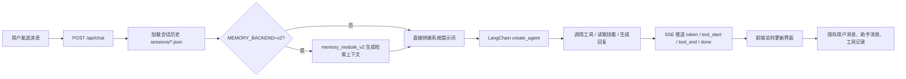

一个本地运行、文件优先、可审计的 AI Agent 工作台。

- 对话会落盘到本地 `JSON`
- 长期记忆由 `memory_module_v2` 管理，采用结构化蒸馏 + 混合检索
- skill不是黑盒函数，而是可读可改的 `SKILL.md`
- Prompt、工具调用、记忆注入、检索过程都能被看到

如果你想做一个“能解释自己为什么这样做”的 Agent，这个项目就是为这个方向准备的。

## 效果展示


## 为什么是它


## 它现在能做什么

当前仓库已经具备一套完整的本地 Agent 基础能力：

- 流式聊天：基于 FastAPI SSE 返回 token、工具调用、分段回复
- 会话持久化：每轮对话保存到 `backend/sessions/*.json`
- 长期记忆：`backend/memory_module_v2/`，支持结构化蒸馏、证据回跳和混合检索
- 本地知识库检索：`backend/knowledge/` + LlamaIndex
- 技能系统：Agent 先看技能快照，再按需读取 `SKILL.md`
- 三栏工作台 UI：会话列表、聊天区、文件检查器
- 文件在线编辑：可直接编辑 Memory / Skills / Workspace 文件
- 记忆注入模式切换：可选择工具调用、每轮自动注入或关闭
- 记忆检索：`memory_module_v2` 提供 `dense + BM25 + RRF` 的混合检索

当前内置的技能包括：

- `天气查询`
- `联网搜索`（Tavily）
- `本地知识库检索`
- `失败恢复经验沉淀`

## 界面结构

前端是一个面向 Agent 调试的三栏工作台：

- 左栏：会话列表、历史消息、Raw Messages
- 中栏：聊天面板、工具调用链、检索卡片、流式输出
- 弹出框：Memory / Skills / Workspace 文件编辑器（Monaco）

这不是一个只给终端用的 Agent，而是一个“能看见自己内部状态”的 Agent IDE。

## 一次请求发生了什么



## 技术栈

### 后端

- Python 3.10+
- FastAPI
- LangChain 1.x `create_agent`
- OpenAI-compatible model API

### 前端

- Next.js 14 App Router
- React 18
- TypeScript
- Tailwind CSS
- Monaco Editor

### 默认模型配置

- LLM Provider: `zhipu`
- LLM Model: `glm-5`
- Embedding Provider: `bailian`
- Embedding Model: `text-embedding-v4`

目前已支持的模型厂商：

- 智谱 `zhipu`
- 百炼 `bailian`
- DeepSeek `deepseek`
- OpenAI 兼容接口 `openai`

## 快速开始

### 1. 环境要求

- Python 3.10+
- Node.js 18+
- npm

### 2. 启动后端

```bash
cd backend
python -m venv .venv
.venv\Scripts\activate
pip install -r requirements.txt
copy .env.example .env
然后补齐环境变量
```

然后启动：

```bash
uvicorn app:app --host 0.0.0.0 --port 8002 --reload
```

### 3. 启动前端

```bash
cd frontend
npm install
npm run dev
```

打开 [http://localhost:3000](http://localhost:3000)。

## 5 分钟体验路线

如果你第一次打开项目，建议按这个顺序体验：

1. 发一条普通聊天消息，感受流式输出。
2. 打开右侧 Inspector，查看当前会话和文件状态。
3. 新建或编辑一个 skill，观察系统如何即时生效。
4. 启用 `MEMORY_BACKEND=v2`，再问一个和长期记忆相关的问题。
5. 查看 `backend/sessions/*.json` 和 `backend/memory_module_v2/` 下的蒸馏与检索结果，确认对话、证据和对象已真实落盘。

## memory_module_v2 是什么

`memory_module_v2` 是这个项目的新一代长期记忆模块，核心目标不是“把所有内容都塞进向量库”，而是把长期记忆拆成两层：

- 索引层：从会话中蒸馏出的结构化对象，用于检索与排序
- 证据层：原始对话片段，用于展示、回跳和注入

它的检索链路是：

- `dense`：通过 Postgres `pgvector` 检索蒸馏对象
- `keyword`：通过 BM25 检索原始 `verbatim` 证据
- `fusion`：通过 RRF 或加权融合合并结果

这意味着：

- Agent 最终看到的是可回跳的原始证据，而不是只读摘要
- 记忆是可审计、可重建、可增量治理的
- 中文和工程型查询可以同时兼顾语义匹配和关键词命中

### 记忆开关

记忆后端由统一环境变量控制：

```env
MEMORY_BACKEND=v2
```

v2 的注入方式由下面变量控制：

```env
MEMORY_V2_INJECT=tool
MEMORY_V2_INJECT_TOP_K=3
```

可选值：

- `tool`：把 `search_memory` 作为工具交给 Agent 自己决定何时调用
- `always`：每轮自动注入检索上下文
- `off`：仅对外暴露 API，不自动注入

### v2 的关键能力

- 结构化蒸馏：把 session 切成 exchange，再蒸馏为对象
- 证据回跳：检索命中后，能回到原始 `session_id + ply range`
- 混合检索：`pgvector` + BM25 + RRF 融合
- 可治理：支持幂等入库、重建、增量扩展和阈值控制
- 可观测：保留命中来源、分数和回跳信息，方便调试

## 项目结构

```text
mini-openclaw/
├── backend/
│   ├── api/                 # 聊天、会话、文件、压缩、配置接口
│   ├── graph/               # Agent 构建、Prompt 组装、Session、Memory 注入
│   ├── tools/               # terminal / python_repl / fetch_url / read_file / knowledge search
│   ├── workspace/           # SOUL / IDENTITY / USER / AGENTS 等系统提示词组件
│   ├── skills/              # 每个技能一个目录，核心是 SKILL.md
│   ├── memory_module_v2/     # 结构化蒸馏 + Postgres + pgvector + BM25 混合检索
│   ├── knowledge/           # 本地知识库
│   ├── sessions/            # 会话 JSON
│   ├── storage/             # 旧版/通用缓存与索引
│   ├── app.py               # FastAPI 入口
│   └── SKILLS_SNAPSHOT.md   # 技能快照
└── frontend/
    └── src/
        ├── app/             # 页面入口
        ├── components/      # 三栏 UI、聊天面板、检索卡片、编辑器
        └── lib/             # API 客户端与全局状态
```

## 核心概念

### 1. 文件即记忆

本项目不是完全不用向量索引，而是把“文件”当作事实源：

- 真正会话记录是 `sessions/*.json`
- `memory_module_v2` 负责把会话蒸馏成可检索的结构化对象
- Postgres 与 BM25 负责构建可丢弃、可重建的索引缓存

也就是说：

- 你能直接读懂 Agent 的记忆来源
- 你能手动修改会话与文件，再重新蒸馏
- 就算索引删了，也能从源文件重建

### 2. 技能即插件

技能不是 Python 函数注册，而是目录中的 `SKILL.md`：

- `backend/skills/get_weather/SKILL.md`
- `backend/skills/web-search/SKILL.md`
- `backend/skills/retry-lesson-capture/SKILL.md`

Agent 会先读取 `SKILLS_SNAPSHOT.md` 知道有哪些技能，再按需读取具体 skill 文件。

这意味着：

- 扩展能力更轻
- 技能更容易审查
- 适合面试展示和教学演示

### 3. Prompt 可解释

每次请求都会重新拼装系统提示词，来源包括：

- `SKILLS_SNAPSHOT.md`
- `workspace/SOUL.md`
- `workspace/IDENTITY.md`
- `workspace/USER.md`
- `workspace/AGENTS.md`
- `memory_module_v2` 的检索结果（启用 v2 时）

所以你改完文件，下一轮请求立刻生效。

## 致谢
初版思路参考 （https://github.com/lyxhnu/langchain-miniopenclaw）

